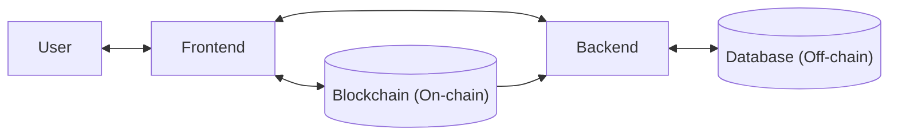

# Tunichain - Blockchain-Powered Tax and Trade Network

A comprehensive platform that brings transparency and efficiency to tax administration and trade processes through blockchain technology. Tunichain connects sellers, banks, and government institutions on a secure, decentralized ledger.

## Key Features

- **Unified Wallet Authentication**:
  - Secure, single sign-on using **SIWE** (Sign-In with Ethereum) standard
  - Web3 wallet integration for seamless authentication
  - Cross-platform identity management with cryptographic proof of ownership
  - Non-custodial authentication that puts users in control of their identity

- **Multi-Role Platform**:
  - **Tax Administration**: Oversee banks, manage sellers, and monitor transactions
  - **TTN (Tunisie TradeNet)**: Validate and verify trade transactions
  - **Sellers**: Create and manage invoices with automatic VAT calculations
  - **Banks**: Process payments and maintain transaction records

- **Smart Contract Suite**:
  - **Security First**: Built with secure design patterns and role-based access control
  - **Transaction Integrity**: Tamper-proof record of all transactions on the blockchain
  - **Automated Compliance**: Invoice validation and automated VAT calculations
  - **Transparent Audit Trail**: Immutable history of all financial transactions

- **Hybrid Architecture**:
  - **Optimized Storage**: Critical data on-chain, supporting documents off-chain
  - **Gas Efficiency**: Minimizes transaction costs by reducing on-chain operations
  - **High Performance**: Fast operations with off-chain processing
  - **Data Integrity**: Cryptographic hashes link off-chain data to on-chain records
  - **Scalability**: Handles high transaction volumes efficiently

## Content
- [Tech Stack](#tech-stack)
  - [Frontend](#frontend)
  - [Backend](#backend)
  - [Blockchain](#blockchain)
- [Architecture](#architecture)
- [Project Structure](#project-structure)
- [Getting Started](#getting-started)
  - [Prerequisites](#prerequisites)
  - [Quick Start](#quick-start)
- [Hybrid data storage](#hybrid-data-storage)
  - [On-Chain Data](#on-chain-data)
  - [Off-Chain Data](#off-chain-data)
- [Data Linking](#data-linking)
- [Documentation](#documentation)
- [Author](#author)

## Tech Stack
### Frontend
- **Framework**: React.js with Vite
- **UI Library**: Material-UI (MUI)
- **Web3 Integration**: ethers.js
- **Authentication**: SIWE (Sign-In with Ethereum)

### Backend
- **Runtime**: Node.js
- **Framework**: Express.js
- **Database**: MongoDB with Mongoose ODM
- **Authentication**: JWT with SIWE

### Blockchain
- **Development Environment**: Hardhat
- **Smart Contracts**: Solidity (EVM compatible)
- **Benchmarking**: Hyperledger Caliper

## Architecture


## Project Structure

```
tunichain/
├── tunichain-backend/     # Backend server
├── tunichain-frontend/    # Frontend application
└── tunichain-hardhat/     # Smart contracts
```

## Getting Started
### Prerequisites
- Node.js 20+
- npm
- [MetaMask](https://metamask.io/download/) with at least 4 pre-funded accounts
- Ethereum node for on-chain storage
- MongoDB 5+ for off-chain storage

### Quick Start
1. Clone the repository
   ```bash
   git clone https://github.com/Ghorbel37/Tunichain
   cd Tunichain
   ```

2. Set up the environment:
   - Copy `.env.example` to `.env` in each directory (tunichain-backend, tunichain-frontend)
   - Update the environment variables as needed
   ```bash
   cp tunichain-backend/.env.template tunichain-backend/.env
   cp tunichain-frontend/.env.template tunichain-frontend/.env
   ```

3. Install dependencies:
   ```bash
   # Install hardhat dependencies
   cd tunichain-hardhat
   npm install

   # Install backend dependencies
   cd ../tunichain-backend
   npm install

   # Install frontend dependencies
   cd ../tunichain-frontend
   npm install
   ```

4. Start the development environment:
   ```bash
   # In separate terminals:
   
   # Terminal 1: Start local blockchain
   cd tunichain-hardhat
   npx hardhat node
   
   # Terminal 2: Deploy contracts (after running the blockchain node)
   cd tunichain-hardhat
   npx hardhat run scripts/deploy-tunichain.js --network localhost
   
   # Make sure MongoDB is running before starting the backend
   # Terminal 3: Start backend
   cd tunichain-backend
   npm run init:db
   npm start
   
   # Terminal 4: Start frontend
   cd tunichain-frontend
   npm run dev
   ```
5. [MetaMask](https://metamask.io/download/) Setup for Local Development:
   - Open MetaMask and create a new network:
     - Network Name: `Hardhat Local`
     - RPC URL: `http://127.0.0.1:8545`
     - Chain ID: `31337`
     - Currency Symbol: `ETH`
   - Make sure to select the new `Hardhat Local` network in MetaMask
   - Import pre-funded accounts (private keys are available in the Hardhat node output in Terminal 1)
   - By default the app uses these accounts (available in Hardhat node):
     - **Tax Administration**: `0xf39Fd6e51aad88F6F4ce6aB8827279cffFb92266` (Account #0)
     - **TTN**: `0xdd2fd4581271e230360230f9337d5c0430bf44c0` (Account #18)
     - Make sure to at least import 2 other accounts for a seller and a bank
   - These accounts come pre-funded with 10,000 ETH each for testing

6. Access the application at `http://localhost:5173`

## Hybrid data storage
### On-Chain Data
- **User Roles & Permissions**: Seller, Bank, and Admin addresses for role-based access control
- **Invoice Metadata**: Full invoice hashes, amounts, VAT rates, and associated seller
- **Payment Records**: Payment proof hashes, associated invoice and associated bank
- **VAT Calculations**: Seller tax amounts for all invoices
- **Audit Trail**: Immutable record of all critical operations

### Off-Chain Data
- **Seller Information**:
  - Business name and tax identification
  - Contact details and email
  - Registration date and status
  
- **Bank Information**:
  - Bank name and BIC (Bank Identifier Code)
  - Registration details and status
  
- **Invoice Details**:
  - Complete invoice data with line items
  - Client information and descriptions
  - Payment and validation status
  
- **Payment Proofs**:
  - Payment details and metadata
  - Associated invoice and bank references

## Data Linking
  - Off-chain documents are hashed and the hashes are stored on-chain
  - On-chain events trigger off-chain processing for linking information
  - Cryptographic proofs ensure data integrity between systems

## Documentation

- [Smart Contracts Documentation](./tunichain-hardhat/README.md)
- [Backend Documentation](./tunichain-backend/README.md)
- [Frontend Documentation](./tunichain-frontend/README.md)

## Author
Developed by [@Ghorbel37](https://github.com/Ghorbel37)
