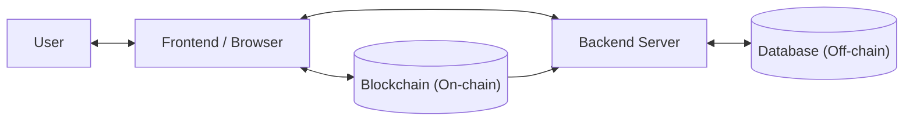
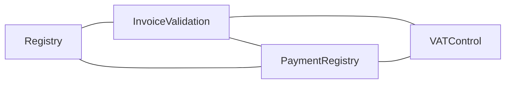

# Tunichain - Project Documentation

> A platform that brings transparency and efficiency to tax administration and trade processes through blockchain technology. Tunichain connects sellers, banks, and government institutions on a secure, decentralized ledger.

---

## Table of Contents

- [Overview](#overview)
- [The Problem Tunichain Solves](#the-problem-tunichain-solves)
- [Key Concepts Explained](#key-concepts-explained)
  - [What Is a Blockchain?](#what-is-a-blockchain)
  - [What Are Smart Contracts?](#what-are-smart-contracts)
  - [What Is a Digital Wallet?](#what-is-a-digital-wallet)
  - [What Does "On-Chain" and "Off-Chain" Mean?](#what-does-on-chain-and-off-chain-mean)
- [Key Features](#key-features)
- [How the System Is Built: Architecture](#how-the-system-is-built-architecture)
- [Technologies Used](#technologies-used)
- [How Data Is Stored: Hybrid Storage](#how-data-is-stored-hybrid-storage)
- [The Smart Contracts: Rules Written in Code](#the-smart-contracts-rules-written-in-code)
- [The Backend: The Engine Behind the Scenes](#the-backend-the-engine-behind-the-scenes)
- [The Application: What Users See and Do](#the-application-what-users-see-and-do)
  - [Tax Administration](#tax-administration)
  - [TTN: Tunisie TradeNet](#ttn-tunisie-tradenet)
  - [Sellers](#sellers)
  - [Banks](#banks)
- [Security and Trust](#security-and-trust)

---

## Overview

Tunichain is a digital platform designed to modernize and secure the way invoices, payments, and VAT are managed between businesses, banks, and tax authorities in Tunisia. It uses blockchain technology - the same underlying technology behind cryptocurrencies - not to create a currency, but to create an **unalterable, transparent record** of every financial transaction and document.

The platform connects four types of participants:
- **Tax Administration** - the government body overseeing tax compliance
- **TTN (Tunisie TradeNet)** - the trade network responsible for validating commercial transactions
- **Sellers** - businesses that issue invoices and collect VAT
- **Banks** - financial institutions that process and confirm payments

Each participant has a dedicated interface tailored to their role, and every action they take is either recorded on the blockchain or linked to a blockchain record - making the entire process transparent, auditable, and resistant to fraud.

---

## The Problem Tunichain Solves

In a traditional invoicing and tax workflow, records are scattered across the systems of individual companies, banks, and government agencies. This creates several problems:

- **Data inconsistency** - a seller's records, a bank's records, and the tax authority's records can all show different things
- **Manual reconciliation** - staff must manually cross-check information across multiple systems, which is slow and error-prone
- **Fraud risk** - invoices and payment records can be altered after the fact
- **Lack of real-time visibility** - tax authorities and trade validators cannot see the current state of transactions as they happen
- **VAT leakage** - without automated tracking, VAT amounts can be misreported or lost

Tunichain addresses all of these by making a single, shared, tamper-proof record the **source of truth** for all parties simultaneously.

---

## Key Concepts Explained

### What Is a Blockchain?

A blockchain is essentially a **shared, permanent ledger** - like a record book that is copied and held simultaneously by thousands of computers around the world. When a new entry is added to this record book, every copy is updated at the same time.

The critical property is that **entries can never be changed or deleted**. Once something is written, it is permanent. If you want to correct an error, you add a new entry that corrects the previous one - but both entries remain visible forever. This makes it impossible to secretly alter records after the fact.

Think of it like writing with a pen in ink versus typing on a computer. On a computer, you can quietly edit a document and no one will know. On a blockchain, every version of every document is permanently preserved and visible to all authorized participants.

For finance and tax purposes, this means:
- An invoice submitted by a seller **cannot be backdated or silently modified**
- A payment confirmed by a bank **cannot be disputed later**
- VAT calculations **cannot be manipulated** - they are computed automatically by rules written in code
- Tax authorities and auditors always have access to the **same real data** as everyone else

### What Are Smart Contracts?

A smart contract is a **set of rules written in computer code** that executes automatically when certain conditions are met - without needing any human to intervene.

Imagine a vending machine: you insert the right amount of money, select your item, and the machine automatically dispenses it. There is no cashier involved, no negotiation, no possibility of the machine "forgetting" to give you your item. The rules are built into the machine itself.

Smart contracts work the same way, but for financial and legal rules. In Tunichain:
- When a seller submits an invoice, the smart contract **automatically calculates the VAT** based on the rate defined for that invoice - no manual calculation needed
- When a bank confirms a payment, the smart contract **automatically records the payment** and links it to the correct invoice - no manual reconciliation needed
- When a TTN officer validates an invoice, the smart contract **permanently records that validation** - it cannot be undone silently

Because these rules are written in code and deployed on the blockchain, they apply equally to everyone and **cannot be overridden** by any single party.

### What Is a Digital Wallet?

A digital wallet (like MetaMask, the one used in Tunichain) is the equivalent of a **digital identity card combined with a secure key**.

In the physical world, you prove who you are by showing an ID card. In Tunichain, each user's identity is their **wallet address** - a unique string of characters that is mathematically tied to a private key only they possess. When you log in, instead of typing a password, you use your wallet to **digitally sign** a message. This signature is cryptographically impossible to forge - it proves you are the owner of that wallet without ever sharing any secret.

This means:
- There are **no passwords to steal or guess**
- There is **no central database of credentials** that can be hacked
- Each user's identity is tied directly to the blockchain, so their permissions and role are always verifiable

### What Does "On-Chain" and "Off-Chain" Mean?

"**On-chain**" means information is stored directly on the blockchain - it is permanent, public to all authorized participants, and cannot be altered.

"**Off-chain**" means information is stored in a traditional database (in Tunichain's case, MongoDB). This data can be updated, searched quickly, and stored in more detail. However, it does not automatically have the same tamper-proof guarantees as on-chain data.

Tunichain uses **both** together in a deliberate way (explained in detail in [How Data Is Stored: Hybrid Storage](#how-data-is-stored-hybrid-storage)).

---

## Key Features

- **Passwordless Identity via Digital Wallet** - Users log in by connecting their digital wallet and signing a message. There are no usernames or passwords. Each user's identity is their wallet address, which is permanently tied to their role on the blockchain.

- **Four Distinct User Roles** - The platform provides entirely different interfaces and permissions for Tax Administration, TTN, Sellers, and Banks. Each role sees only what is relevant to them and can only perform the actions they are authorized for.

- **Automated VAT Calculation** - VAT is calculated automatically by a smart contract the moment an invoice is submitted. There is no manual calculation, no spreadsheet, no risk of human error or manipulation.

- **Invoice Validation by TTN** - TTN officers can mark any invoice as valid or invalid directly through the platform. That decision is recorded on the blockchain immediately and is visible to all parties.

- **Payment Confirmation by Banks** - When a bank processes a payment, they attach a payment receipt to the invoice on the platform. The payment is recorded on the blockchain, instantly updating the invoice's status for all parties.

- **Real-Time Synchronization** - The moment anything changes on the blockchain - an invoice is submitted, a payment is confirmed, a validation is issued - the platform updates automatically for every user. There is no need to manually refresh or reconcile records.

- **Complete Audit Trail** - Every action taken on the platform - who did it, when, and what exactly changed - is permanently recorded. Tax authorities and auditors can access the full history of any transaction at any time.

- **Tamper-Proof Records** - Because critical records are stored on the blockchain, it is technically impossible for any single party to alter them after the fact. A seller cannot modify an invoice once submitted. A bank cannot dispute a payment it already confirmed.

- **Monthly Seller Reports** - Tax Administration can generate monthly invoice and VAT reports for any individual seller directly from the platform, based on the verified on-chain data.

---

## How the System Is Built: Architecture

Tunichain is made up of three connected layers that work together:

Here is what each layer does, in plain terms:

**1. The Application (what you see in your browser)**
This is the website you interact with. It has different screens depending on your role: Tax Administration sees management dashboards, sellers see their invoices, banks see payment queues, and so on. When you click a button to submit an invoice or confirm a payment, the application sends that action either to the blockchain directly (for permanent recording) or to the backend server (for storing details).

**2. The Backend Server (the invisible engine)**
Think of this as the **administrative office** of the platform. It handles everything that does not need to be permanently on the blockchain: storing the full details of invoices, seller profiles, bank records, and so on. It also acts as a **bridge**: whenever something important happens on the blockchain (a payment confirmed, an invoice validated), the backend is automatically notified and updates its own records to match. This keeps everything in sync at all times.

**3. The Blockchain (the public, permanent record)**
This is the **immutable ledger**. It stores only what needs to be permanent and tamper-proof: the fingerprints of documents, the amounts, the roles of participants, the validation decisions, and the payment confirmations. Nothing stored here can ever be changed or deleted.

**4. The Database (the detailed filing cabinet)**
The traditional database stores the full, rich details of every entity: complete invoice line items, seller contact information, bank details, and so on. This data is linked to the blockchain through cryptographic fingerprints (explained below), so its integrity can always be verified.

The three software modules that make up the system are:

| Module | Plain-language description |
|---|---|
| `tunichain-hardhat` | The set of rules (smart contracts) deployed on the blockchain |
| `tunichain-backend` | The server that manages data, syncs with the blockchain, and serves the application |
| `tunichain-frontend` | The website and user interface that participants interact with |

---

## Technologies Used

Tunichain is built on a set of modern, well-established technologies. Here is a plain-language explanation of what each one is and why it matters.

### Frontend (the user-facing application)

- **React.js** - The library used to build the interactive user interface. React allows parts of the screen to update instantly when data changes (for example, when an invoice's payment status is confirmed) without needing to reload the whole page.
- **Vite** - The build tool that compiles the frontend application into a form the browser can run. It makes development significantly faster than older alternatives.
- **Material-UI (MUI)** - A library of pre-built, professionally styled visual components - buttons, tables, forms, navigation drawers, and modals - that ensure a consistent, polished, and responsive design across all devices and screen sizes.
- **ethers.js** - A JavaScript library that allows the browser application to communicate directly with the Ethereum blockchain. It is used to read data from smart contracts and to send transactions (such as submitting an invoice or confirming a payment) to them.
- **SIWE (Sign-In with Ethereum)** - A standardized protocol that defines exactly how a digital wallet is used to authenticate a user. It works by having the user sign a server-issued challenge message with their private key. The server then verifies that signature cryptographically, confirming the user's identity without any password exchange.

### Backend (the server)

- **Node.js** - The runtime environment that executes the backend server code. It is designed to handle large numbers of simultaneous connections efficiently, making it well-suited for a platform where many users may be active at once.
- **Express.js** - The framework built on top of Node.js that defines the server's REST API - the specific web addresses (endpoints) that the frontend calls to retrieve or submit data.
- **MongoDB** - The database where all off-chain data is stored: full invoice details, seller profiles, bank records, and payment proofs. MongoDB is a document-oriented database, meaning it stores records as flexible structured documents (similar to a JSON file) rather than in rigid rows and columns like a traditional spreadsheet. This makes it well-suited to financial records that vary in structure.
- **Mongoose** - A layer on top of MongoDB that enforces rules about what data looks like before it is saved. For example, it ensures that every invoice must have an amount, a seller reference, and a VAT rate - preventing incomplete records from entering the database.
- **JWT (JSON Web Token)** - The format of the temporary session credential issued to a user after they successfully authenticate. After login, the browser includes this token with every request to the server, proving the user is authenticated without needing to re-verify with the blockchain on every click.

### Blockchain (the smart contract layer)

- **Solidity** - The programming language in which the smart contracts are written. It is purpose-built for writing executable rules that run on the Ethereum blockchain, with built-in concepts for ownership, access control, and financial operations.
- **Hardhat** - The development environment used to write, compile, test, and deploy the smart contracts. It includes a local blockchain simulator that allows developers to run the entire system on their own machine during development and testing, before deploying to a real network.
- **Ethereum Virtual Machine (EVM)** - The execution engine shared by Ethereum and all EVM-compatible blockchains. When a smart contract is called, the EVM runs its code on every node in the network simultaneously, ensuring all participants reach the same result and that no single node can tamper with the outcome.

---

## How Data Is Stored: Hybrid Storage

Tunichain uses a deliberate strategy of storing some data on the blockchain and some in a traditional database. Understanding why this split exists helps clarify what guarantees the platform provides.

### Why Not Store Everything on the Blockchain?

Storing data on a blockchain costs money (each transaction has a small fee called "gas") and is slow compared to a traditional database. Storing a full invoice with all its line items, client names, and addresses on the blockchain would be unnecessarily expensive and inefficient.

### Why Not Store Everything in a Traditional Database?

A traditional database can be edited by whoever controls it. If invoice records, VAT amounts, and payment confirmations were only in a database, there would be no independent way to verify they hadn't been altered. One party could quietly change a number without leaving any trace.

### The Hybrid Approach

Tunichain solves both problems together:

- **Full details** (invoice line items, seller names, contact information, etc.) are stored in the traditional database - fast, cheap, searchable
- A **cryptographic fingerprint** (called a "hash") of each document is stored on the blockchain - permanent and tamper-proof

A fingerprint works like this: if you take any document and run it through a mathematical function, you get a unique string of characters. Change even a single letter in the document, and the fingerprint becomes completely different. By storing the fingerprint on the blockchain, anyone can later take the document from the database, recompute its fingerprint, and check whether it matches what is on the blockchain. If it matches, the document is authentic. If it doesn't match, the document has been tampered with.

This gives the platform the **speed and flexibility of a traditional database** combined with the **tamper-proof guarantees of a blockchain**.

### What Is Stored Where

**On the Blockchain (permanent, tamper-proof):**
- The identity (wallet address) of every registered seller, bank, and administrator
- The fingerprint and financial summary of every invoice (amount, VAT rate, associated seller)
- The fingerprint of every payment receipt, linked to its invoice and bank
- Per-seller VAT totals, computed automatically by the smart contract
- A complete log of every action taken: registrations, validations, payments

**In the Database (detailed, searchable, linked to blockchain records):**

| Entity | Details Stored |
|---|---|
| **Sellers** | Business name, tax identification number, contact details, email address, registration date and approval status |
| **Banks** | Bank name, BIC (Bank Identifier Code), registration details, approval status |
| **Invoices** | Complete invoice with all line items, client name and information, descriptions, payment status, TTN validation status |
| **Payment Proofs** | Payment amount and date, bank reference, link to the corresponding invoice |

### How the Two Layers Stay Linked

When an invoice is submitted, its fingerprint is stored on the blockchain. The blockchain then emits a notification (called an "event") - like a receipt being printed. The backend server is always listening for these notifications. The moment it receives one, it automatically updates the database to reflect the new on-chain state. This means both layers are always synchronized, without any manual intervention.

---

## The Smart Contracts: Rules Written in Code

The smart contracts are the heart of Tunichain's trust model. They are the rules of the platform encoded directly into the blockchain - rules that apply equally to everyone and cannot be changed without full transparency.

There are four smart contracts, each with a specific responsibility:

> All contracts check the Registry before allowing any action. If a wallet address does not have the required role, the action is rejected.

### Registry: The Access Control List

This contract is the **gatekeeper** of the entire platform. Think of it as the official register of who is allowed to do what.

Before any seller can submit an invoice, their wallet address must be registered and approved in the Registry. Before any bank can confirm a payment, their wallet address must be in the Registry. Before any Tax Administration officer can add a new participant, their wallet address must have the administrator role in the Registry.

Every other contract checks the Registry before allowing any action. If your wallet address is not in the Registry with the right role, you simply cannot perform that action - no exceptions, no workarounds.

This means:
- An unregistered seller cannot submit invoices
- An unregistered bank cannot confirm payments
- A seller cannot validate their own invoices (only TTN can)
- A bank cannot register other banks (only Tax Administration can)

### InvoiceValidation: The Invoice Ledger

This contract handles the lifecycle of every invoice on the platform. When a seller submits an invoice, this contract records its fingerprint, amount, VAT rate, and the seller's identity on the blockchain. It also notifies the rest of the system (via an event) so the backend can store the full invoice details in the database.

This contract works together with VATControl to automatically compute the VAT owed at the moment of invoice submission.

### PaymentRegistry: The Payment Ledger

This contract handles payment confirmations. When a bank confirms that a payment has been made, this contract records the payment receipt's fingerprint on the blockchain, links it to the correct invoice, and identifies which bank processed it. It also triggers VATControl to update the seller's VAT paid balance.

### VATControl: The Tax Calculation Engine

This contract automatically manages VAT for every seller. It tracks three figures per seller:
- The **tax base** (the total pre-VAT amount of all their invoices)
- The **VAT owed** (the total VAT that should be collected across all invoices)
- The **VAT paid** (the VAT actually collected through confirmed payments)

These figures are computed and updated automatically each time an invoice is submitted or a payment is confirmed - no manual entry, no spreadsheet, no risk of error. Tax Administration can query these figures at any time for any seller.

### How the Contracts Were Verified

Before deployment, all four smart contracts went through a comprehensive automated test suite that verified:
- That only users with the correct role can perform each action (e.g., only TTN can validate invoices)
- That registrations and approvals work correctly
- That attempting an unauthorized action is correctly blocked
- That VAT calculations produce accurate results in all scenarios
- That all contracts interact correctly with each other

---

## The Backend: The Engine Behind the Scenes

The backend server is the invisible engine that powers the platform. Users never interact with it directly, but it handles everything that happens between the user interface and both the blockchain and the database.

### Authentication Without Passwords

When a user opens the application and connects their digital wallet, the backend issues a unique challenge - essentially a one-time message that is freshly generated for that specific login attempt. The user's wallet digitally signs this message using their private key. The backend then verifies that signature. If valid, it issues a JWT (JSON Web Token) - a short-lived, encrypted session credential - that the user's browser presents with every subsequent request to prove they are logged in.

This means:
- There are no passwords stored anywhere in the system
- There is no "forgot password" vulnerability
- There is no central password database that could be breached
- Every user's identity is ultimately tied to their wallet, which only they control
- If a session token expires or is stolen, it cannot be reused - a new wallet signature is required

### Always in Sync with the Blockchain

The backend runs a permanent background process called a **blockchain event listener**. Every time a smart contract records something on the blockchain - an invoice submitted, a payment confirmed, a seller registered - the blockchain emits a notification called an "event" (similar to a push notification). The backend receives this event within seconds and immediately updates the database to match the new on-chain state.

This means:
- The database is always an accurate reflection of the blockchain's state
- Users never see outdated or inconsistent data
- No manual synchronization or reconciliation is ever needed
- Tax authorities always see the current status of every invoice and payment in real time

### Protecting Every Action

Before the backend processes any request - whether it is "show me all invoices" or "register this new seller" - it performs two sequential checks:

1. **Is the user properly authenticated?** - Is their session token valid and not expired?
2. **Does their role allow this action?** - Does their wallet address have the required permissions on the blockchain?

Only if both checks pass does the backend proceed. This means authorization rules are enforced at the server level, not just in the user interface. Even a technically sophisticated user who bypasses the visual interface cannot perform an action their blockchain role does not permit.

### What the Backend Manages

| Area | What It Does |
|---|---|
| **Authentication** | Issues wallet-based login challenges, verifies signatures, manages session tokens |
| **Seller Management** | Stores and retrieves full seller profiles, links them to blockchain registrations |
| **Bank Management** | Stores and retrieves bank profiles, links them to blockchain registrations |
| **Invoice Management** | Stores complete invoice details, links each invoice to its on-chain fingerprint |
| **Payment Management** | Stores payment proof details, links each payment to its invoice and blockchain record |
| **User Profiles** | Retrieves user profile information and queries on-chain role assignments |
| **Blockchain Sync** | Listens to smart contract events and keeps the database continuously up to date |

---

## The Application: What Users See and Do

The application is a web platform accessible from any modern browser. Each user logs in with their digital wallet, and the platform automatically detects their role by reading it from the blockchain. The navigation menu, available pages, and permitted actions all change depending on the role - a seller sees their own invoices, a bank sees its payment queue, and Tax Administration sees the full platform overview.

---

### Tax Administration

Tax Administration has the broadest oversight on the platform. This role is responsible for onboarding new participants and monitoring the entire financial and tax ecosystem.

#### Managing Banks
Tax Administration is the only role that can add new banks to the platform. When a bank is added, its wallet address is registered in the blockchain's Registry smart contract, granting it the ability to confirm payments. The bank's full details - name, BIC code, contact information - are also stored in the database.

Tax Administration can view the complete list of all registered banks at any time.

#### Managing Sellers
Similarly, Tax Administration is responsible for registering sellers on the platform. When a seller is registered, their wallet address is added to the blockchain and their profile - business name, tax identification number, contact details - is stored in the database.

Tax Administration can browse all registered sellers, view their profiles, and monitor their status.

#### Invoice Oversight
Tax Administration has a global view of all invoices across every seller on the platform. They can:
- Browse the full list of invoices, filtered by seller, status, or date
- Open any invoice to see its complete details: line items, client information, amounts, VAT, TTN validation status, and payment status
- See at a glance which invoices are pending validation, which are validated, and which have been paid

#### Payment Monitoring
Tax Administration can see all payment receipts across the platform - which invoices have been paid, by which bank, and when. This provides a complete real-time picture of cash flows across all sellers and banks.

#### Seller Reports
For audit and tax compliance purposes, Tax Administration can generate a monthly report for any individual seller. This report is built directly from the verified blockchain data and shows all invoices issued that month, their VAT amounts, and their payment and validation status. This report can be used in official tax assessments.

---

### TTN: Tunisie TradeNet

TTN's primary function on the platform is to act as the **trade validation authority**. They verify that invoices correspond to real, legitimate commercial transactions before those invoices can be paid.

#### Seller Visibility
TTN can view all registered sellers and their information. This allows them to know who is operating on the platform and to make informed validation decisions.

#### Invoice Validation
This is TTN's central function. For each invoice on the platform, TTN officers can:
- View the complete details of the invoice - client, line items, amounts, VAT
- Mark it as **valid** - confirming that the transaction is legitimate and the invoice is accurate
- Mark it as **invalid** - flagging it as problematic, which prevents the bank payment process from proceeding for that invoice

The validation decision is recorded permanently on the blockchain the moment it is made. It is immediately visible to the seller, the bank, and Tax Administration. TTN can also review the full history of all validations they have issued.

#### Payment Verification
TTN can view all payment receipts on the platform, allowing them to cross-reference validated invoices with confirmed payments and verify that financial flows align with the commercial transactions they have certified.

---

### Sellers

Sellers are businesses that use Tunichain to issue invoices to their clients and track the lifecycle of those invoices through validation and payment.

#### Creating Invoices
Sellers can create a new invoice directly in the platform. The invoice includes:
- Client information
- A list of line items (description, quantity, unit price for each)
- The applicable VAT rate

When the seller submits the invoice, the platform does two things simultaneously:
1. Stores the full invoice details in the database
2. Records the invoice's fingerprint (hash), total amount, VAT rate, and the seller's wallet address on the blockchain via the InvoiceValidation smart contract

The VAT amount is calculated automatically by the VATControl smart contract - the seller does not need to compute it manually, and it cannot be misreported.

#### Tracking Invoice Status
Each invoice a seller has created shows its current status in real time:
- **TTN Validation Status** - whether TTN has validated it, invalidated it, or not yet reviewed it
- **Payment Status** - whether a bank has confirmed payment for it

The seller can open any invoice to see its full details, including a complete audit trail of every status change it has gone through.

---

### Banks

Banks on the platform are responsible for confirming payments and permanently recording the proof of those payments.

#### Viewing Unpaid Invoices
Banks have access to the list of all invoices that have been validated by TTN but not yet paid. This gives them a clear, real-time queue of transactions awaiting payment confirmation.

#### Confirming Payments
When a bank processes a payment for an invoice, they can:
- Open the invoice on the platform
- Attach the payment receipt (the proof of payment document)
- Mark the invoice as paid

When this action is confirmed, two things happen simultaneously:
1. The payment receipt's fingerprint (hash) is recorded on the blockchain via the PaymentRegistry smart contract, permanently linking it to the invoice and the confirming bank
2. The VATControl smart contract automatically updates the seller's VAT paid balance

From this moment, the invoice is marked as paid for all participants - the seller, Tax Administration, and TTN all see the updated status immediately.

#### Payment History
Banks can review the full history of all payments they have processed on the platform, including access to the payment receipts attached to each one.

---

## Security and Trust

Tunichain was designed with the following core trust properties:

**No single point of control.** No single participant - not even Tax Administration - can unilaterally alter records that have been committed to the blockchain. Every action is governed by the smart contracts, which apply the same rules to everyone without exception.

**Complete traceability.** Every action on the platform - who registered whom, who submitted which invoice, who validated it, who paid it, and when - is permanently recorded and can be audited at any time. Nothing is hidden, nothing disappears.

**Verified identities.** Every participant's identity is their wallet address, which is cryptographically controlled. It is technically impossible to impersonate another participant without possessing their private key - something that never leaves their device.

**Automatic rule enforcement.** Business rules - who can do what, how VAT is calculated, what constitutes a valid payment - are encoded in Solidity smart contracts and enforced automatically by the Ethereum Virtual Machine. There is no reliance on human gatekeepers who might make mistakes or be influenced.

**Data integrity across both layers.** Even the data stored in the traditional MongoDB database - which could theoretically be edited by someone with database access - is protected by cryptographic fingerprints stored on the blockchain. Any tampering with the database would immediately be detectable by comparing document fingerprints against what is recorded on-chain.

---

## Author

**Ghorbel37**

*Written on 21/04/2026* | *Updated on 21/04/2026*
